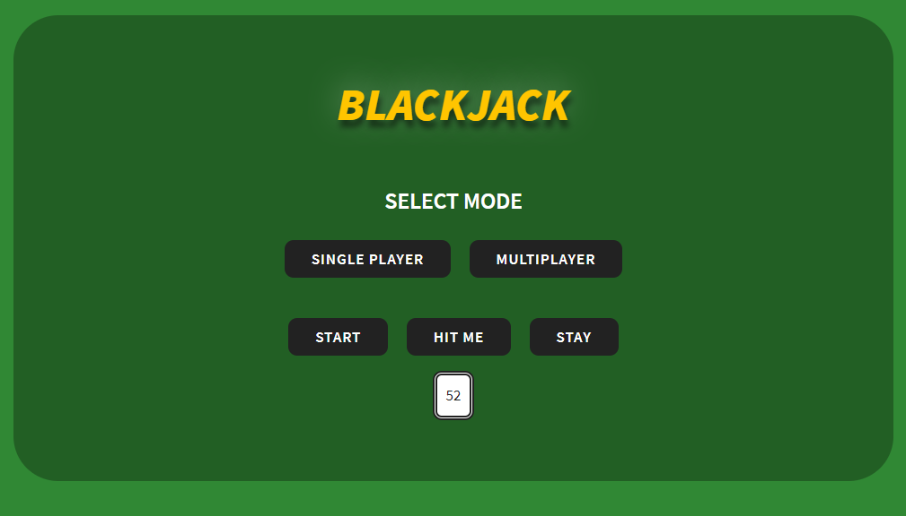
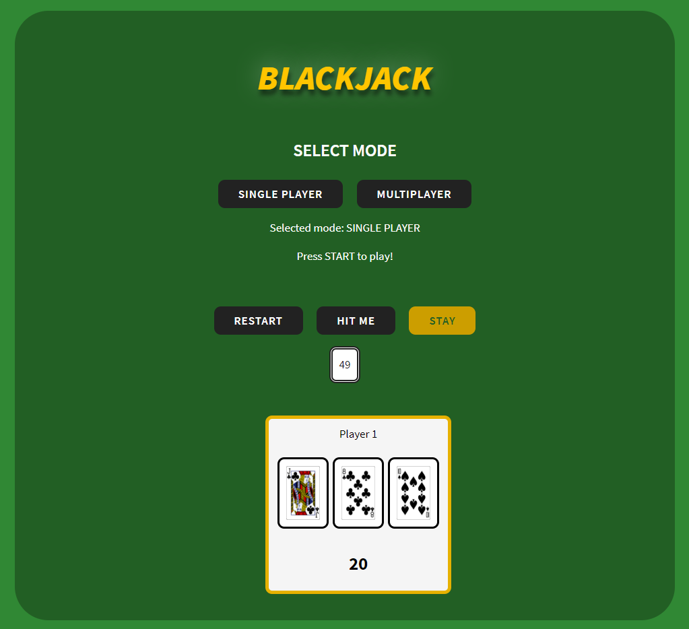
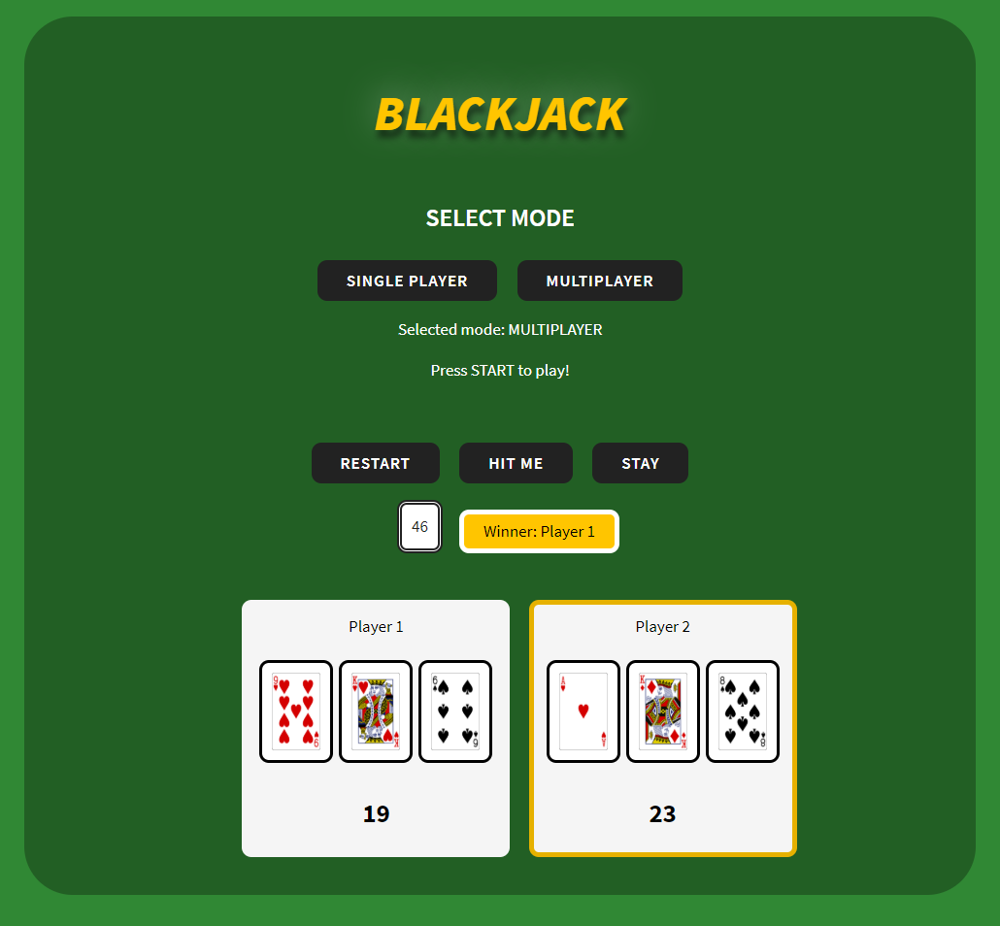

# blackjack-game

Blackjack game based on TypeScript, HTML, SCSS and free public [API](https://deckofcardsapi.com/)

## Table of contents

- [blackjack-game](#blackjack-game)
  - [Table of contents](#table-of-contents)
  - [General info](#general-info)
  - [Screenshots](#screenshots)
  - [Technologies](#technologies)
  - [API](#api)
  - [Setup](#setup)
  - [Demo](#demo)
  - [Features](#features)
  - [Status](#status)
  - [Contact](#contact)

## General info

A simple card game where you draw cards in order to get the number of cards you have as close as possible (but not greater than) 21. The player receives no more cards from the deck until he or she decides that he does not want any more cards or gets a score of 21 or bigger. A sum greater than or equal to 22 means you lose. The exception to this rule is when a player receives two aces. It always means winning. If neither player gets a score of 21, the one closest to that value wins

## Screenshots







## Technologies

- [TypeScript](https://www.typescriptlang.org/) - version 3.9.7
- [webpack](https://webpack.js.org/) - version 4.44.1
- [Sass/scss](https://sass-lang.com/)

## API

<https://deckofcardsapi.com/>

## Setup

1. Clone the repo

```sh
git clone https://github.com/Joanna-Chadzynska/blackjack-game
```

2. Install NPM packages

```sh
npm install
```

3. Start dev mode

```sh
npm start
```

4. Build version

```
npm run build
```

## Demo

<https://magic21.netlify.app/>

## Features

List of features ready and TODOs for future development

- Game mode selection: single player or multiple players
- Each player receives two cards from the deck using [API](#api)
- The player has the option to stay or draw a card by pressing the appropriate button

To-do list:

- Responsive Web Design
- Create an animation for decks and cards
- Add unit tests using [Jasmine](https://jasmine.github.io/index.html)

## Status

Project is: _in progress_

## Contact

Created by [Joanna Chądzyńska](https://www.linkedin.com/in/joanna-chądzyńska/) - feel free to contact me!
